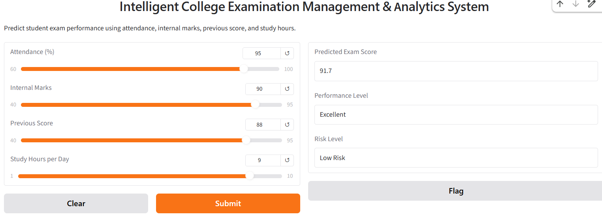

# Intelligent College Examination Management & Analytics System

## 📌 Project Overview

The Intelligent College Examination Management & Analytics System is an AI-powered machine learning project designed to predict student exam performance and identify students who may be at academic risk.

The system uses student-related factors such as attendance, internal marks, previous scores, and study hours to predict the expected exam score.

## 🎯 Objectives

- Predict student exam scores using Machine Learning
- Analyze important factors affecting student performance
- Classify students based on performance level
- Identify students who may be at academic risk
- Provide an interactive prediction interface using Gradio

## 🛠️ Technologies Used

- Python
- Pandas
- NumPy
- Matplotlib
- Scikit-learn
- Gradio
- Google Colab

## 🤖 Machine Learning Models

Two regression models were evaluated:

1. Linear Regression
2. Random Forest Regressor

### Model Comparison

| Model | MAE | R² Score |
|---|---:|---:|
| Linear Regression | 3.62 | 0.75 |
| Random Forest | 4.35 | 0.69 |

Based on the evaluation results, **Linear Regression** was selected as the final model.

## 📊 Input Features

The model uses:

- Attendance
- Internal Marks
- Previous Score
- Study Hours

## 📈 Performance Levels

| Exam Score | Performance |
|---|---|
| 85+ | Excellent |
| 70–84 | Good |
| 50–69 | Average |
| Below 50 | Needs Improvement |

## ⚠️ Risk Levels

| Exam Score | Risk Level |
|---|---|
| 70+ | Low Risk |
| 50–69 | Moderate Risk |
| Below 50 | High Risk |

## 🖥️ Interactive Application

A Gradio-based interface allows users to enter student information and receive:

- Predicted Exam Score
- Performance Level
- Risk Level

## 📁 Project Files

- `Intelligent_College_Exam_Management_System.ipynb` — Complete project notebook
- `student_exam_performance_analysis.csv` — Student dataset used for analysis and model development

## 🚀 Future Improvements

- Add a database for real college student records
- Add student login and authentication
- Build an admin dashboard
- Add automatic academic alerts
- Deploy the application permanently
- Improve the model using larger real-world datasets

## 👨‍💻 Author

Hari Dalai
